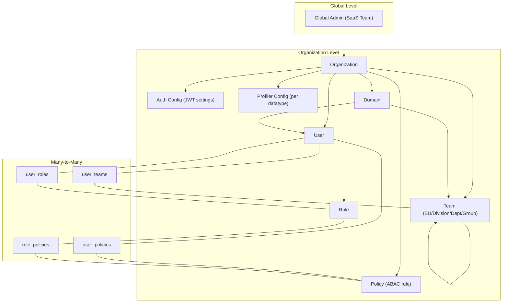
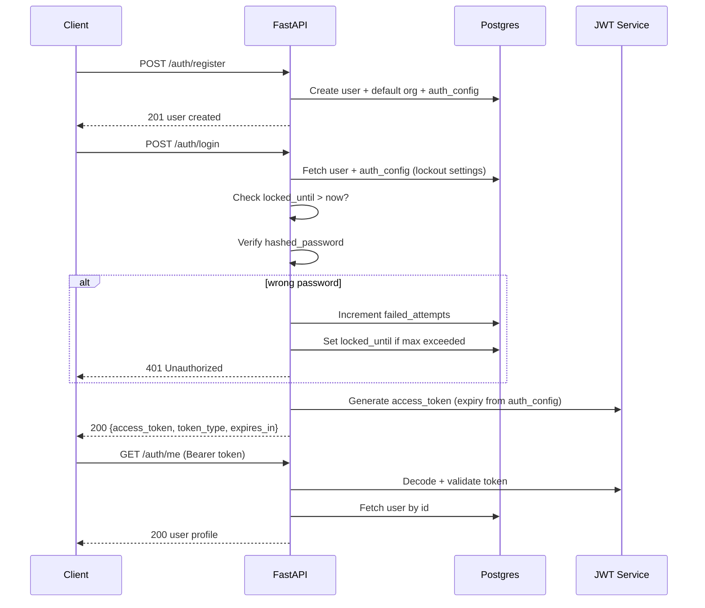

# Auth & Organization Hierarchy — Implementation Plan

## Architecture Overview



---

## Auth Flow



---

## File Structure

```
backend/
├── app/
│   ├── main.py                    (update: register auth router)
│   ├── db.py                      (no change)
│   ├── settings.py                (update: add JWT_SECRET_KEY)
│   ├── models.py                  (keep stub, auth models separate)
│   └── auth/
│       ├── __init__.py
│       ├── models.py              (all DB tables)
│       ├── schemas.py             (Pydantic request/response)
│       ├── service.py             (JWT, hashing, lockout logic)
│       ├── dependencies.py        (get_current_user, require_admin)
│       └── router.py              (all endpoints)
├── alembic/
│   ├── env.py
│   ├── script.py.mako
│   └── versions/
│       └── 0001_auth_org_hierarchy.py
├── testcases/
│   └── test_auth.py               (new)
└── deltameta_api_doc.md           (new)
```

---

## Step 1 — New Dependencies

Add to `[backend/requirements.txt](backend/requirements.txt)`:

```
python-jose[cryptography]==3.3.0
passlib[bcrypt]==1.7.4
python-multipart==0.0.9
pydantic-settings==2.0.3
```

---

## Step 2 — Settings Update

Add to `[backend/app/settings.py](backend/app/settings.py)`:

```python
jwt_secret_key: str = "change-me-in-production"
jwt_algorithm: str = "HS256"
```

Add `JWT_SECRET_KEY` to `backend/.env`.

---

## Step 3 — Database Models

New file: `[backend/app/auth/models.py](backend/app/auth/models.py)`

All tables use `deltameta` schema. Using SQLAlchemy 2.0 `DeclarativeBase`.

### Table Summary

| Table                 | Key Columns                                                                                                                                                                                             |
| --------------------- | ------------------------------------------------------------------------------------------------------------------------------------------------------------------------------------------------------- |
| `organizations`       | id (UUID), name, slug, description, is_active, is_default, created_by, created_at                                                                                                                       |
| `auth_config`         | org_id (FK), jwt_expiry_minutes, max_failed_attempts, lockout_duration_minutes, sso_provider                                                                                                            |
| `domains`             | id (UUID), org_id (FK), name, description, owner_id (FK→users)                                                                                                                                          |
| `teams`               | id (UUID), org_id, parent_team_id (self-ref), name, display_name, email, team_type, description, domain_id, public_team_view                                                                            |
| `policies`            | id (UUID), org_id, name, description, rule_name, resource, operations (JSONB), conditions (JSONB)                                                                                                       |
| `roles`               | id (UUID), org_id, name, description, is_system_role                                                                                                                                                    |
| `role_policies`       | role_id (FK), policy_id (FK)                                                                                                                                                                            |
| `users`               | id (UUID), org_id, name, display_name, description, email, username, hashed_password, image, domain_id, is_admin, is_global_admin, is_active, is_verified, failed_attempts, locked_until, last_login_at |
| `user_teams`          | user_id (FK), team_id (FK)                                                                                                                                                                              |
| `user_roles`          | user_id (FK), role_id (FK)                                                                                                                                                                              |
| `user_policies`       | user_id (FK), policy_id (FK)                                                                                                                                                                            |
| `org_profiler_config` | id (UUID), org_id, datatype (e.g. bigint), metric_types (JSONB)                                                                                                                                         |
| `subscriptions`       | id (UUID), org_id (nullable), user_id (nullable), resource_type, resource_id                                                                                                                            |

`team_type` enum: `business_unit`, `division`, `department`, `group`
`sso_provider` enum: `default`, `google`, `cognito`, `azure`, `ldap`, `oauth2`

---

## Step 4 — Alembic Setup & Migration

- Initialize Alembic: `alembic init alembic`
- Configure `[backend/alembic/env.py](backend/alembic/env.py)` to read `PRIMARY_DATABASE_URL` from settings and set `search_path = deltameta`
- Create migration `0001_auth_org_hierarchy.py`:
  - `CREATE SCHEMA IF NOT EXISTS deltameta`
  - Create all 13 tables above
  - Seed: 1 global admin user (email from `.env`), 1 default organization, default `auth_config` row

---

## Step 5 — Pydantic Schemas

`[backend/app/auth/schemas.py](backend/app/auth/schemas.py)`

| Schema             | Fields                                                                                         |
| ------------------ | ---------------------------------------------------------------------------------------------- |
| `RegisterRequest`  | name, display_name, email, username, password, org_name (optional)                             |
| `LoginRequest`     | email or username, password                                                                    |
| `TokenResponse`    | access_token, token_type, expires_in                                                           |
| `UserResponse`     | id, name, display_name, email, username, image, is_admin, org_id, domain_id, teams, roles      |
| `OrgResponse`      | id, name, slug, description                                                                    |
| `AuthConfigUpdate` | jwt_expiry_minutes, max_failed_attempts, lockout_duration_minutes                              |
| `PolicyCreate`     | name, description, rule_name, resource, operations, conditions                                 |
| `RoleCreate`       | name, description, policy_ids                                                                  |
| `TeamCreate`       | name, display_name, email, team_type, description, domain_id, public_team_view, parent_team_id |

---

## Step 6 — Auth Service Logic

`[backend/app/auth/service.py](backend/app/auth/service.py)`

- `hash_password(plain)` → bcrypt hash
- `verify_password(plain, hashed)` → bool
- `create_access_token(user_id, org_id, expiry_minutes)` → signed JWT
- `decode_access_token(token)` → payload dict or raise 401
- `check_lockout(user, auth_config)` → raise 403 if `locked_until > now`
- `handle_failed_attempt(user, auth_config, db)` → increment counter, set `locked_until` if max exceeded
- `reset_failed_attempts(user, db)` → clear on successful login

---

## Step 7 — Dependencies

`[backend/app/auth/dependencies.py](backend/app/auth/dependencies.py)`

- `get_current_user(token, db)` → decode JWT, fetch user from DB, return user object
- `require_active_user(user)` → raise 403 if not active
- `require_org_admin(user)` → raise 403 if not `is_admin`
- `require_global_admin(user)` → raise 403 if not `is_global_admin`

---

## Step 8 — API Endpoints

`[backend/app/auth/router.py](backend/app/auth/router.py)`

| Method | Path                    | Auth     | Description                        |
| ------ | ----------------------- | -------- | ---------------------------------- |
| `POST` | `/auth/register`        | None     | Register new user, auto-create org |
| `POST` | `/auth/login`           | None     | Login, returns JWT                 |
| `POST` | `/auth/logout`          | Bearer   | Logout (client-side token drop)    |
| `POST` | `/auth/refresh`         | Bearer   | Refresh token                      |
| `GET`  | `/auth/me`              | Bearer   | Get own profile                    |
| `PUT`  | `/auth/me`              | Bearer   | Update own profile                 |
| `POST` | `/auth/forgot-password` | None     | Send reset email (stub)            |
| `POST` | `/auth/reset-password`  | None     | Set new password with reset token  |
| `GET`  | `/auth/config`          | OrgAdmin | Get JWT/lockout config for org     |
| `PUT`  | `/auth/config`          | OrgAdmin | Update JWT/lockout config for org  |

---

## Step 9 — Test Cases

New file: `[backend/testcases/test_auth.py](backend/testcases/test_auth.py)`

Using `pytest` + `httpx.AsyncClient` + in-memory SQLite (or test Postgres schema).

| Test                                 | Scenario                                             |
| ------------------------------------ | ---------------------------------------------------- |
| `test_register_success`              | New user + org created, returns 201                  |
| `test_register_duplicate_email`      | Same email returns 409                               |
| `test_login_success`                 | Valid credentials return JWT with correct expiry     |
| `test_login_wrong_password`          | Returns 401, failed_attempts incremented             |
| `test_login_lockout`                 | After N failed attempts, account locked, returns 403 |
| `test_login_after_lockout_expired`   | Login succeeds once lockout_duration_minutes elapsed |
| `test_get_me_authenticated`          | Valid token returns user profile                     |
| `test_get_me_no_token`               | Returns 401                                          |
| `test_get_me_expired_token`          | Returns 401                                          |
| `test_update_config_as_org_admin`    | Org admin can change JWT expiry, max attempts        |
| `test_update_config_as_regular_user` | Returns 403                                          |
| `test_refresh_token`                 | Valid token returns new token                        |

Add to `requirements-dev.txt`:

```
pytest==7.4.0
pytest-asyncio==0.21.1
httpx==0.24.1
```

---

## Step 10 — API Documentation

New file: `[backend/deltameta_api_doc.md](backend/deltameta_api_doc.md)`

Documents every endpoint with:

- Method, path, description
- Request body schema
- Response schema
- Error codes
- Example request/response (curl + JSON)

---

## Execution Order (for Agent mode todos)

1. Add dependencies to `requirements.txt` and `requirements-dev.txt`
2. Update `settings.py` with `jwt_secret_key`, `jwt_algorithm`
3. Create `backend/app/auth/models.py`
4. Initialize Alembic, configure `env.py` for `deltameta` schema
5. Generate migration `0001_auth_org_hierarchy.py` (all tables + seed)
6. Create `backend/app/auth/schemas.py`
7. Create `backend/app/auth/service.py`
8. Create `backend/app/auth/dependencies.py`
9. Create `backend/app/auth/router.py`
10. Register router in `backend/app/main.py`
11. Create `backend/testcases/test_auth.py`
12. Create `backend/deltameta_api_doc.md`
